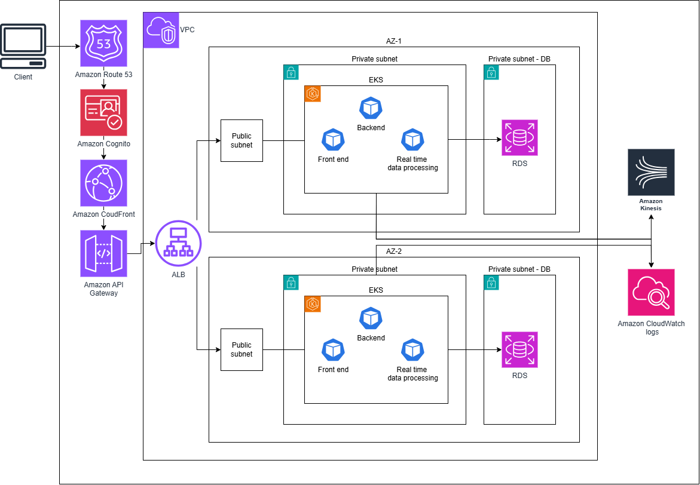

this diagram shows the architecture of my Veeva-assignment app.

### Architecture Explained:

**Amazon Route 53-** routes user requests to CloudFront CDN using a DNS record.

**Amazon Cognito-** manages authentication and authorization and handles user sign-up, sign-in, and access control for the application.

**AWS WAF** – a Web Application Firewall applied on CloudFront to enforce common security rules and protect the application from common web exploits.

**Amazon Cloudfront-** a CDN that delivers the application’s front-end content using edge locations for low latency and high availability.

**Amazon API Gateway-** manages API requests, routing them to the backend API pods and handling authentication, authorization, and rate limiting.

**ALB-** an Amazon Load Balancer connected to public subnets in both AZ's for distributing traffic to pods in private subnet.

The infrastructure includes two Availability Zones for high availability and disaster recovery.  
In each AZ, there is:  
- a public subnet for the ALB  
- a private subnet for the EKS node group  
- a private subnet for RDS

For the compute resource I chose EKS cluster with node groups. it allows deployment and autoscaling of microservices, and flexible node autoscaling.

The EKS node group has auto-scaling enabled, with a minimum of 2 nodes and a maximum of 5 nodes, allowing the cluster to adjust capacity based on workload demands. (Values may be adjusted after reviewing cluster metrics)

The EKS cluster has three deployments:  
- Front End  
- Backend  
- Real-time Data Streaming

Each deployment has an HPA enabled for autoscaling, configured with a CPU utilization target of 70%, and a minimum of 2 pods and a maximum of 10 pods. (to be adjusted after reviewing metrics.)

For the database, I have chosen Amazon RDS with Multi-AZ deployment for high availability and disaster recovery, and automatic failover and backups.

For real-time data streaming, the pods connect to Amazon Kinesis for ingesting and processing streaming data.

Monitoring and logs are collected and managed using Amazon CloudWatch.

**Monitoring Metrics & Alerting Strategy:**

*EKS Pods & Nodes:*

| Metric             | Warning Threshold              | Critical Threshold              |
| ------------------ | ------------------------------ | --------------------------------|
| CPU utilization    | 70% for 5 min                  | 85% for 5 min                   |
| Memory utilization | 70%                            | 80%                             |
| Disk I/O           | –                              | –                               |
| Network I/O        | –                              | –                               |
| Pod restarts       | ≥ 1 restarts per pod in 10 min | ≥ 3 restarts per pod in 10 min  |
| Failed scheduling  | > 1 events for 2 min           | > 3 events in 5 min             |

*API :*

| Metric                | Warning Threshold | Critical Threshold |
| --------------------- | ----------------- | ------------------ |
| Request latency (p95) | > 500 ms          | > 2 s              |
| Throughput            | –                 | –                  |
| Error rate (5xx)      | > 1%              | > 5%               |

*Kinesis:*

| Metric                   | Warning Threshold | Critical Threshold |
| ------------------------ | ----------------- | ------------------ |
| Queue depth              | > 1 min           | > 5 min            |
| Processing latency (p95  | > 30 s            | > 2 min            |
| Error rate (5xx)         | > 1%              | > 5%               |

*RDS:*

| Metric                   | Warning Threshold   | Critical Threshold   |
| ------------------------ | ------------------- | -------------------- |
| CPU utilization          | 70% for 5 min       | 80% for 5 min        |
| Freeable memory          | < 1 GB for 10 min   | < 500 MB for 10 min  |
| Disk usage               | < 20% free          | < 10% free           |
| Connections count        | > 80% of max        | > 90% of max         |
| Read/Write latency (p95) | > 100 ms for 5 min  | > 300 ms for 5 min   |
| Replication lag          | > 30–60 s for 5 min | > 5 min for 5–10 min |

*ALB:*

| Metric            | Warning Threshold | Critical Threshold |
| ----------------- | ----------------- | ------------------ |
| Request count     | –                 | –                  |
| Latency (p95)     | > 500ms           | > 2s               |
| Error rate (5xx)  | > 1%              | > 5%               |
| Unhealthy targets | –                 | > 0                |

*CloudFront:*

| Metric           | Warning Threshold | Critical Threshold |
| ---------------- | ----------------- | ------------------ |
| Cache hit ratio  | < 70%             | -                  |
| Latency (p95)    | > 200ms           | > 500ms            |
| Error rate (5xx) | > 1%              | > 5%               |

thresholds are tuned after observing production baselines.

**Suggestions for Future Enhancements:**

Configure HPA based on custom metrics

Create centralized dashboards in CloudWatch for system overview.

Add cache layer for api responses (Redis).

Integrate Kinesis with AWS Lambda or AWS Analytics services to enable real-time analytics dashboards.

### Coding:
In this repo, under the terraform directory, I have written Infrastructure as Code for this architecture.

This IaC is partial and not fully completed, but it demonstrates the technical skills I have.

It is recommended to apply the bootstrap script first to automate backend environment before deploying the infrastructure. This script creates required S3 bucket and creates a DynamoDB lock table.

The Terraform code is organized into modules:

*Networking module*- Creates a VPC and, for each of the two availability zones, creates:
Public subnet,
Private subnet for the node group,
Private subnet for the database.

*EKS module*- Creates an EKS cluster and node group, and installs the ALB Controller.

*App module*- Creates three deployments: frontend, backend, and datastream. with a Cluster IP
service for frontend and backend.. Horizontal Pod Autoscaler (HPA) is configured with a CPU threshold of 70%. Deployments are spread evenly across availability zones. An ALB Ingress is created for the frontend deployment.

*RDS module*- Creates a multi-AZ RDS database with ingress allowed from the node group’s security group. The database materuser's password is managed and stored in AWS Secrets Manager. Pod access is handled through IAM roles.

*WAF module*- Creates a WAF ACL on CloudFront to enforce common rules.

*CloudFront module*- Creates a CloudFront Distribution for serving traffic to ALB

**Future steps:**
- Switch managed IAM policies for least privilege IAM custom policies.
- Consider migratimg to Terragrunt for easier and more efficient environment managing.
- Pod access configuration to the RDS database
- Route 53 DNS
- CloudWatch metrics
- Kinesis
- Cognito
- API Gateway

### Cost Optimization Strategies:

**Spot Instances for Data Processing:** Real-time data processing pods run on a dedicated Spot Instance Node Group. Even if AWS reclaims an instance, Kubernetes will simply reschedule the pod on another node. (since the data stream is buffered in Amazon Kinesis, any instance interruption handled by EKS results in zero data loss)

**Right-Sizing:** Perform load testing to establish baselines. After deployment,  use automated tools (AWS Compute Optimize) to analyze CPU/Memory utilization and reduce over-provisioned instances.

**Storage Auto-scaling for RDS:** Start with the minimum required and enable Storage Auto-scaling. This prevents paying for unused space.

**CloudWatch Logs Lifecycle:** Implement Retention Policy to delete\archive logs after a defined period.

**RDS Snapshot Lifecycle:** Configure Automated Backup Policy with a defined retention window.
